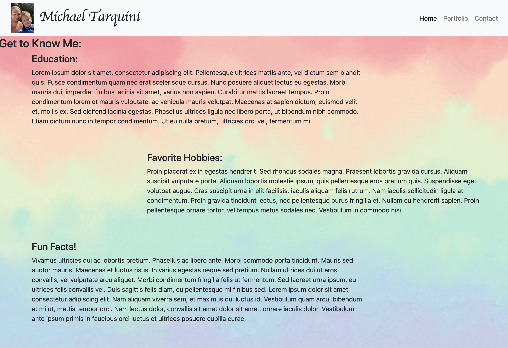
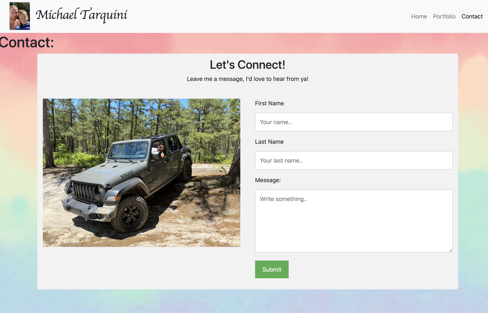

# Homework 2 = Bootstrap Responsive Design

The goal of this homework assignment was to create a functional application that included a bio section, portfolio section, and a contact section.  The deployed webpage should have active links in the navbar, as well as a responsive layout, and working contact form. 

## index.html 
* shows general information about me
* includes a navbar with active links

## portfolio.html
* displays images of different types of food I have eaten 
* includes an appetizer column, entree column, and a dessert column

## contact.html
* this page shows line inputs for first and last name and a message

